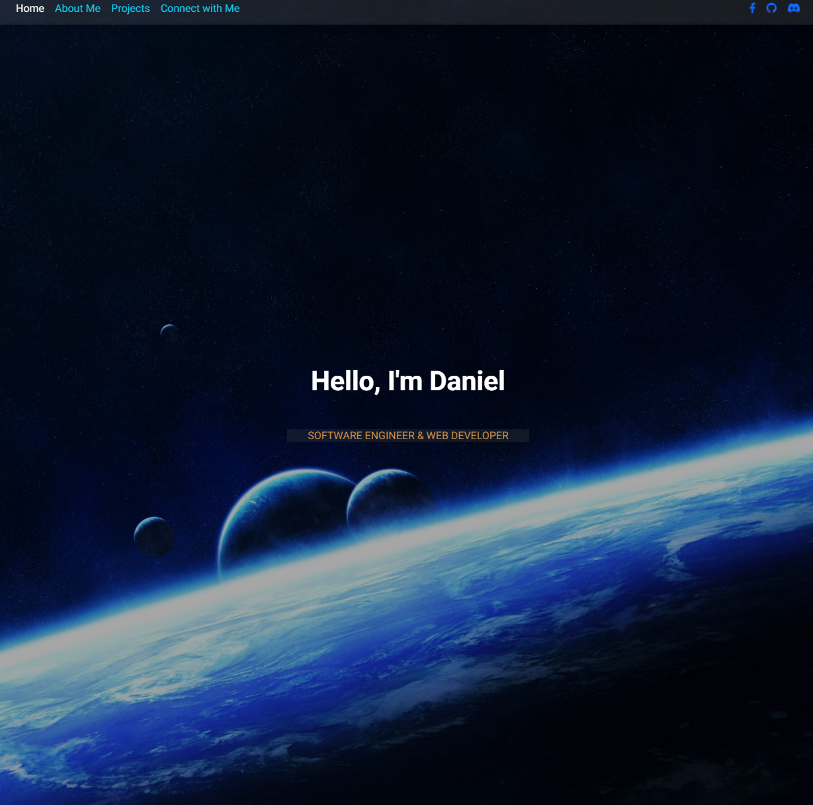
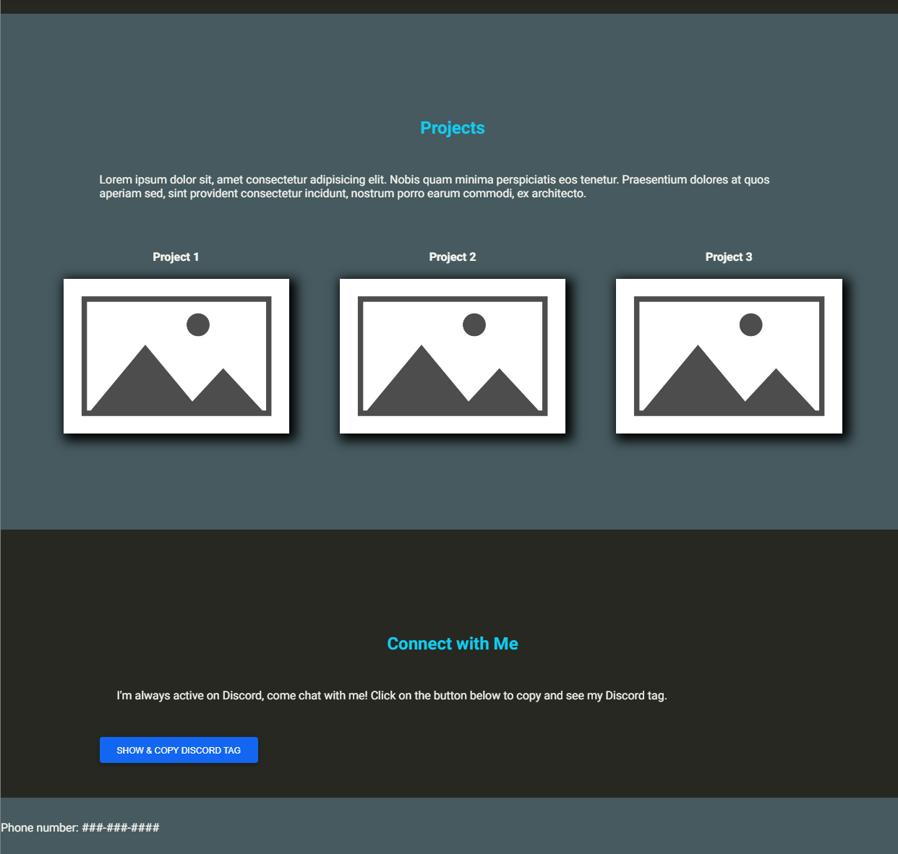

# Personal-Porfolio-Cutdown   
link to repository: https://github.com/DanTheDev-zsh/Personal-Portfolio-Cutdown   
deployed page: https://danthedev-zsh.github.io/Personal-Portfolio-Cutdown/
## Short Description
---
This is a portfolio of me. Currently, I don't have much contents to show, but this is meant for me to demonstrate HTML and CSS that I've learned in the first week (about 6 days) of class.

## Screenshots
---

 
 

#### Important disclosure for whom would grade this challenge.
---
This is a stripped down version (without js libraries and js) of my Personal-Portfolio linked below. The original repo uses libraries and frameworks that would be inappropriate for this challenge, so I am rewrote all css rules from Bootstrap (Model Design Bootstrap), and removing all self-written and library/framework APIs used. I was told and also decided that this is better for grading because the class has yet to cover javascript and APIs, but I wanted this repo to be reusable as a professional porfolio for résumé, so I wanted to include some JS knowledge I have prior.
I spent about 75% of the effort programming/understanding the framework and libraries to make the main repo, and used the last 25% or approximately 4 hours to port/debug weird css rules of this repo. This page might not meet some criteria, but I think the time I've spent reading and learning about the libraries used was a good learning process for myself.

 original repo I wrote for this assignment: https://github.com/DanTheDev-zsh/Personal-Portfolio        
 the deployed page: https://danthedev-zsh.github.io/Personal-Portfolio/    
